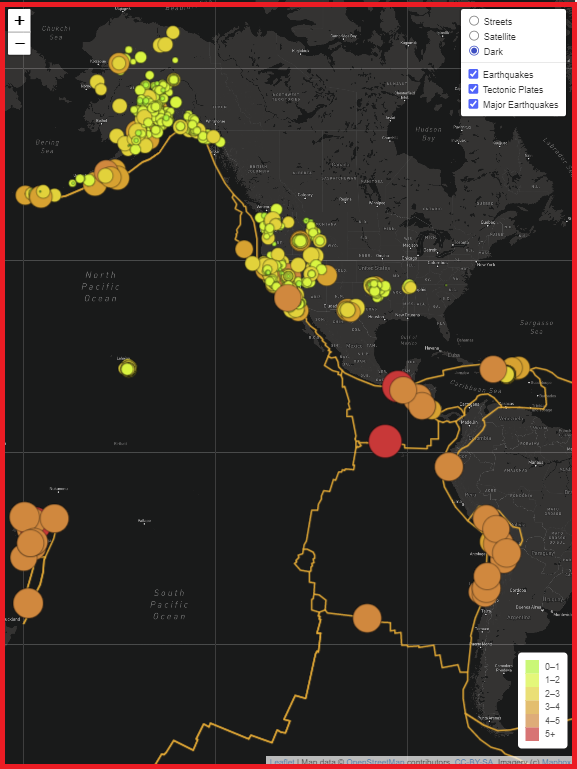

# Mapping_Earthquakes
New project on Mapping_Earthquakes analysis. Adjusting the current web app.

## Project Overview
Working with Diaster Reporting Network to create data visualizations to view earthquake data in relation to the tectonic plates’ location on the earth. They would like to see all the earthquakes with a magnitude greater than 4.5 on the map, and they would like to see the data on a third map. Ergo, this assignment consists of three technical deliverables. They are:

- Deliverable 1: Add Tectonic Plate Data
- Deliverable 2: Add Major Earthquake Data
- Deliverable 3: Add an Additional Map

## Purpose
The purpose of this project is to visually show the differences between the magnitudes of earthquakes all over the world for the last seven days.

## Resources
- **Data Source:** `tectonic_plate_starter_logic.js`, `major_eq_starter_logic.js`, `index.html`,
- **Software:** `VS Code`, `Web Browser`, `Command-line interface`, `GitHub`

## Mapping_Earthquakes Results
>
>**Image showing the Mapping_Earthquakes web app:**
>
>